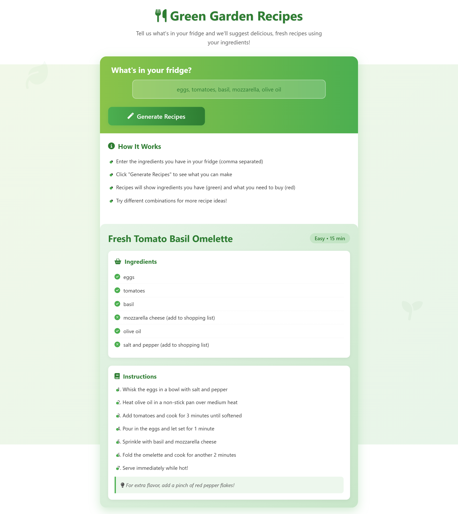

# 🥗 Green Garden Recipe Generator

<div align="center">



*A beautiful, intuitive web app that transforms your fridge ingredients into delicious recipes*

[](https://developer.mozilla.org/en-US/docs/Web/HTML)
[](https://developer.mozilla.org/en-US/docs/Web/CSS)
[](https://developer.mozilla.org/en-US/docs/Web/JavaScript)
[](https://fontawesome.com)

</div>

## 🌟 Key Features

### 🎨 Fresh Green Color Scheme
- **Calming shades of green** (#4CAF50, #8BC34A, #388E3C)
- **Natural gradients** that evoke garden freshness
- **Clean white backgrounds** with subtle green accents
- **Modern, nature-inspired design**

### 🖱️ Simple & Intuitive Interface
- **Clear input field** for ingredients (pre-filled with sample data)
- **Prominent "Generate Recipes" button** with hover animations
- **Visual indicators** for ingredients you have vs. missing items
- **Responsive design** that works perfectly on all devices

### 📋 Smart Recipe Display
- **Difficulty level** and **preparation time** for each recipe
- **Ingredients clearly marked** with visual status indicators
- **Step-by-step instructions** with helpful cooking tips
- **Missing ingredients highlighted** for easy shopping lists

### ✨ User Experience Enhancements
- **Smooth animations** for all interactions
- **Mobile-first responsive design**
- **Helpful "How It Works"** section explaining the process
- **Visual feedback** when no recipes match your ingredients

### 🍳 Practical Features
- **Sample recipe database** with realistic ingredients
- **Percentage-based matching algorithm** (shows recipes with at least 50% match)
- **Pre-filled sample ingredients** for immediate use
- **Clear visual distinction** between available and needed ingredients

## 🚀 How It Works

The app automatically suggests recipes based on what you have in your fridge, showing exactly which ingredients you need to buy:

1. **Enter Ingredients** → List what's in your fridge (comma separated)
2. **Generate Recipes** → Click the magic button
3. **Cook & Enjoy** → Follow the step-by-step instructions

## 📸 Demo


*The app suggests recipes like Fresh Tomato Basil Omelette, Caprese Stuffed Tomatoes, and Tomato Basil Pasta based on your available ingredients.*

## 🛠️ Installation & Usage

### Quick Start
1. **Clone the repository**
   ```bash
   git clone https://github.com/yourusername/green-garden-recipes.git